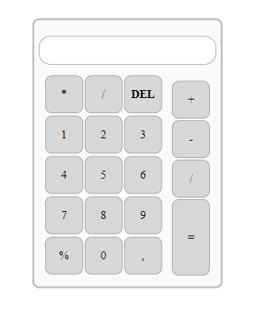

# Calculadora

He creado una Calculadora utilizando HTML, CSS y JAVASCRIPT. 
En esta caluladora se utilizo el llamado de los ID de cada boton de la calculadora, se agregaron eventos y funciones. Tambien se utilizo la funcion  switch.

Esta calculadora puede realizar operaciones de Suma, Resta, Multiplicacion y Division. 

Despliegue:
<a href="https://super-licorice-f8d961.netlify.app/">Calculadora<a/>

  
